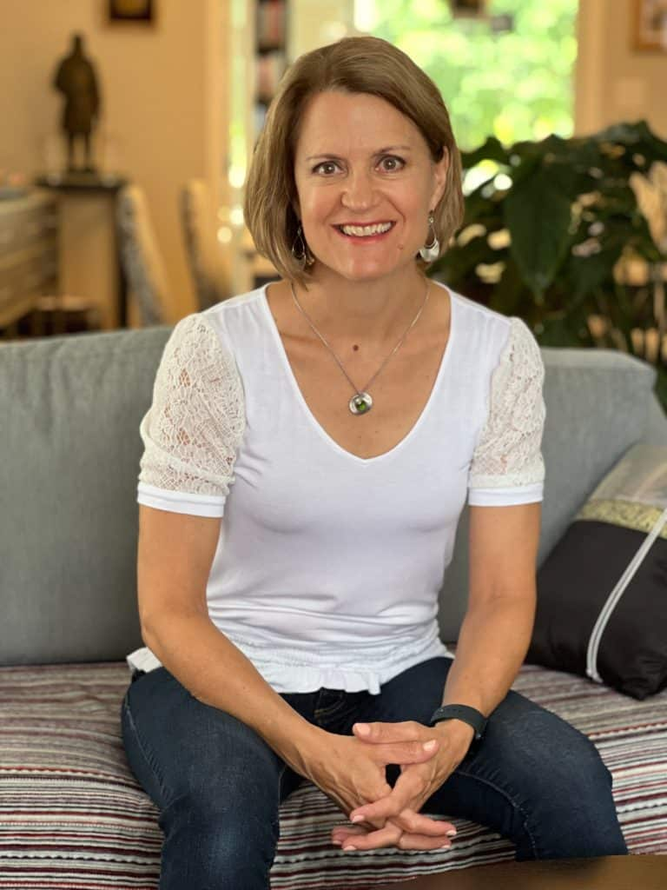
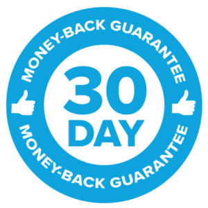

### Your Foundation to Financial Freedom Group Coaching Add-on

### This is your chance to take what you’ve learned in the course and get immediate results…

#### … with the help of an expert guide and a group of women who are on the path to financial freedom, too.

##### We’ll help you figure out the next best step for you, move past challenges, and stay on track.

##### No more procrastinating, avoidance, getting stuck, and not knowing what to do.

##### We meet live via Zoom every other Wednesday night, from 7:30 pm – 9:00 pm Eastern.

##### Join us today and let’s get you the time and money freedom you want as quickly as possible.

##### We won’t just show you the path; we’ll walk it with you.

 

## Student Success Stories

### This could be you …

I did coaching with Doris as part of the course. The coaching felt very personal and practical - it goes far beyond any generic advice or models. Doris is very good at what she does!  
Before the course, I don't think I realized what it takes to establish good patterns, regularly monitor money, set meaningful goals, and engage in regular reflection. I didn't expect it to be personal or emotional.  
**Doris's emails, modules and coaching have so much value and they make a meaningful impact by making visible things that have been invisible and deeply ingrained, unconsciously shaping our finances for years.**

 

Elizabeth C.

I knew this financial journey would be transformative, but I didn't imagine this! I f\*\*\*ing love Doris!!! She is my financial fairy godmother! **Doris's money system and her coaching have been a huge part of turning my life around.**  
She is the exact kind of cheerleader that I need in my life to stay on track towards a new way of being. She also has the ability to challenge me to push myself in a motivating way. I'm thanking the universe for her again.

 

Diane S.

Doris is brilliant at synthesizing info and providing a list of doable action items that yield impactful results. **I've used what I've learned from Doris and her course** - her lessons on mindset and her values-based system - **to pay off five figures of corrosive debt, triple my income and increase my financial literacy exponentially.**

 

Eva S.

Doris is an amazing coach! Her "no shame, no blame, no judgment" philosophy helped put me at ease to face my finances.**  
I finally uncovered and released some key subconscious beliefs that had been holding me back for years. I now feel more confident about my earning power and how to manage my money.** And discovering my core values is now changing the way I spend. I highly recommend her course!

 

Anne O.

## Want the best results? Get a year of coaching, support, and guidance.

After fifteen years of working with clients, there’s no arguing with the results: People who get coaching get deeper, faster results.

That translates to reaching your goals sooner and getting much more value from your money.

Here’s what you receive in each package.

### PREMIUM PACKAGE

##### With the Premium Package, you have access to live, bi-weekly coaching sessions for a full year.

The coaching sessions take place every other Wednesday evening from 7:30 pm – 9:00 pm Eastern. You can access the next coaching session as soon as you register.

Think of this as **Drop In Office Hours**. Attend as many sessions (or as few) as you like.

If you aren’t available for a scheduled session, but you have a question, I’ve got you covered. All the sessions are recorded. You can still submit a question and listen in at your convenience after the session.

When a financial question pops up over the next year, you get to reach out to me during the group coaching sessions and say, “Hey Doris, **what’s the best way to handle this**? What are my options and how do I choose?”

Or, “Doris, I’m stuck. I just can’t seem to get moving. Can you help me through this?”

You can transform your finances much more quickly when you have someone in your corner, *in real time*, who’s been there, gotten the results, and coached thousands of other women to do the same.

### PLATINUM PACKAGE

#### Want a more personalized approach?

Then hop into the Platinum Package and get the VIP experience with:

- private coaching sessions in addition to the group coaching sessions.
- on-call access to me via Voxer, a messaging app, for Q&A and coaching. Ask me as many questions as you like, as often as you like every Monday through Friday.
- a review of your finances and customized Action Plan for the year ahead.

Over the next year, we’ll work closely together to help you overcome any money challenges you face and get you on track with your financial goals.

This is also a great option if you want to take your finances to the next level.

We can move as quickly or as slowly as you need in this **Done *With* You** package.

Meet Your Guide

#### Hi, I’m Doris!

I’m a financial literacy educator who has helped thousands of women take control of their money and create great options for themselves.

In my early thirties, I was widowed and left with $400,000 of debt, which I paid off in two years. I’ve since built a multi-seven-figure net worth and a thriving business – using an evidence-based approach and my skills as a trained researcher.

Here’s what I know to be true:

It doesn’t matter who you are, what you know, or what your current situation is. **Financial freedom is possible with the right system, ongoing support, and a safe, no shame, no blame, no judgment environment in which to learn.**

#### This is that safe space for you.

In this course, I created the system and the plan that I wish I’d had years ago when I stared down a mountain of debt.

At the time, it felt like I had few options for my future.

This course would have changed my life.

I created it so that *you* can achieve financial security, peace of mind, and freedom in a tiny fraction of the time it took me to figure it out and make it happen.

**Life is short. Don’t waste another minute settling for less than you want. You can do this. I’ll show you how.**

Hop into the course and let’s get you to financial freedom as soon as possible!

 

## You'll be backed by a 30-Day Money Back Guarantee

**If you’re thinking, “This sounds great, but I’m still not 100% sure” you can try the course risk-free with my 30-Day Money-Back Guarantee.**

I know what it’s like to be interested in taking a course, but you wonder, “Will this meet my expectations? What if I don’t like it?”

I *know* that my students get great results when they do the lessons and implement what they’ve learned, but I get that you don’t know that yet.

I want you to feel confident about taking this step and to be fully satisfied with your purchase.

So if you’re on the fence, or if other trainings have left you disappointed…

Then **I want to give you the opportunity to dive into the material and experience the feeling of empowerment and excitement** that comes taking control of your money – *risk-free*.

That’s why I’m offering a **30-Day** **Money Back Guarantee:**

If you’ve watched the video lessons, completed the exercises, attended the group coaching sessions and you don’t find the course useful by the end of 30 days, send me an email and I will happily refund your full payment within 30 Days of your registration. No hard feelings!

I’m SO confident that if you implement what you learn inside *Your Foundation to Financial Freedom*, you’ll transform your money and your life.

**You have nothing to lose and a bright, secure future to gain.**

## Burning Questions from Previous Course Students

**Question #1:** “I want to take your course and I'm considering the Premium package, but I’m not sure of my schedule over the next few months. What if I’m not available when a module is released or when there’s a coaching call?”

You will receive an email with the link when each module is released, but that doesn’t mean you have to start at that time or even on that day.

The **lessons are pre-recorded,** and you have **lifetime access** to the course, so you can start and proceed on your schedule.

With the Premium Package, you get access to one year of group coaching sessions.

All the **group coaching sessions** will be recorded.

If you have a question and you know you won’t be available for one of the calls, simply submit your question ahead of time and I’ll address it during the coaching segment. You can watch the recording at a time that works for you.

**Question #2:** “What if I have a question as I’m going through the course? Do you offer coaching or support?”

There are three different course packages to choose from. If you would like access to coaching and and Q&A with Doris, choose either the Premium or the Platinum Package.

The Essential package is for self-guided learning. That said, you will have access to the **private Facebook group** where students can ask questions, support each other, and exchange ideas.

If you have a question about accessing the course or you’re having technical issues, you can reach out to us for help. The contact email for our support team is provided in the welcome email once you register.

**Question #3:** “What if the course isn’t a fit for me. Can I get a refund?”

Absolutely! I’m so confident in the value of the program that I offer a 30-Day **100% Money-Back Guarantee.** If you’re not happy, you’ll get every penny back within 30 days of the course start date. No hassles or hard feelings!

**Question #4:** “Do I need math or tech skills to do this course? I'm not great at either. Will this affect my results with the course?"

Absolutely not. You don’t need any math or tech skills to get great results with this course. I wanted this course to work for everyone, which is why I show you exactly what to do and how to go about calculating the key number you’ll need.

If doesn’t matter if you hated math class, nor does it matter if you don’t know the first thing about spreadsheets. There’s nothing fancy or complicated in the course. It’s a simple system that works for everyone. You’re good to go!

**Question #5:** "Do I get the full course all at once?"

The Modules are released on a weekly basis, with Module 1 becoming accessible the day you register. The following modules are released in the following weeks. There are two Implementation Weeks built into the program to give you time to do the fun work.

Remember that you also have lifetime access to the program. You don’t have to watch the modules on the day they become available!

**Question #6:** "I'm torn between the Essential Package and the Premium Package. Which would be better for me?

I’ll be honest here. The Essential Package is for self-driven, committed DIYers.

There is a lot of data about online courses and it’s crystal clear: Unless a student has support, ongoing accountability and help when life gets challenging, odds are they won’t finish the course.

I also know from fifteen years of coaching that the people who get the best and fastest results are the ones I coach directly. Everyone benefits from coaching.

Here’s my suggestion: If you can do it, get the Premium Package that comes with twelve months of coaching. It will make a huge difference.

If you can’t swing it, then start where you can with the Essential Package and hop into the course Facebook Group to connect with your peers.

**Question #7:** "I notice that you only talk about women. I'm a guy and I'm interested in taking your course. Is that possible or is it just for women?"

It’s true that the course was designed by a woman for women. It’s also true that the coached options are for women only. However, the Essential Package, which is self-guided, is open to everyone with one caveat.

Men are welcome to purchase the Essential Package. That will give them access to the important information about how to create a values-based money management system. They just won’t have access to the Facebook Group. The latter is solely for women to preserve the safety of the space for all women.

I do offer private coaching for everyone. If you think you would benefit from coaching, reach out and ask to set up a Discovery Call to discuss what makes sense for you.

**Question #8:** "The payment plan for the Essential Package has 3 payments whereas the plan for the Premium Package has 12 payments. Why the difference?"

Both the Premium and Platinum Packages offer payment plans over 12 months because that’s the duration of the group coaching sessions for those levels.

The content for the Essential Package is delivered within three months. The number of payments reflects the time it takes to receive the complete content for the level in question.

## Still wondering if you should do this? 🤔

## Ask yourself this question:

**If I don’t do this – make my financial goals a priority and invest in myself – what will be different about my life this time next year?**

✨ Will I be closer to my goals?

✨ Will I feel less stress and overwhelm?

✨ Will I have knocked off the debt that is weighing me (and my future) down?

✨ Will my savings account balance be significantly larger?

✨ Will I have a sufficient Emergency Fund in place?

✨ Will I feel good about my spending and have a plan in place to achieve my goals?

✨ Will I be in control of my money?

**If the answer to any of the questions above is “no”, then click on the Enroll Now button and let’s go.**

You *do* have what it takes to be financially strong. I’m here to guide you every step of the way.

## It's not too late

*

If you’re worried that it’s too late for you …

- Too late to pay off your debt.
- Too late to save enough for retirement.
- Too late to leave a job you don’t like.
- Too late to reach financial freedom

I want to reassure you that it is definitely *NOT* too late.

I hear this concern from 30-somethings and 60-somethings alike. My answer is the same every time:

When you learn my **proven, values-based framework** – with a strong emphasis on a healthy money mindset – and you receive **the support you need** to handle the bumps in the road, **achieving financial freedom isn’t just possible for you, it’s doable *by you.***

*

*

## You deserve to have a life you love without financial stress and overwhelm.

You also deserve a money management system that serves you, and not the other way around.

It doesn’t have to be hard and painful.

I say this as someone whose life was upended in her early thirties by loss, crippling debt, and no easy path to income.

**It took me years of endless research, burning the candle at both ends, deprivation, experimentation, and false starts to finally crack the money code.**

**Today, I’m financially free and I know how to help you get here in a tiny fraction of the time it took me.**

There is a world of abundance just waiting for you. I can show you the path to that world.

Hop into the course and let’s get you there as quickly as possible.

I can’t wait to meet you and cheer you on inside *Your Foundation to Financial Freedom*!

I’ll see you on the inside.

All my best,

Doris

*

*

## Your Foundation to Financial Freedom is coming soon.

Please complete the form to add your name to the wait list. We’ll let you know as soon as the course is released!

## No spam, ever. Unsubscribe any time.

## IMS ESSENTIAL

Please select a payment type:

*